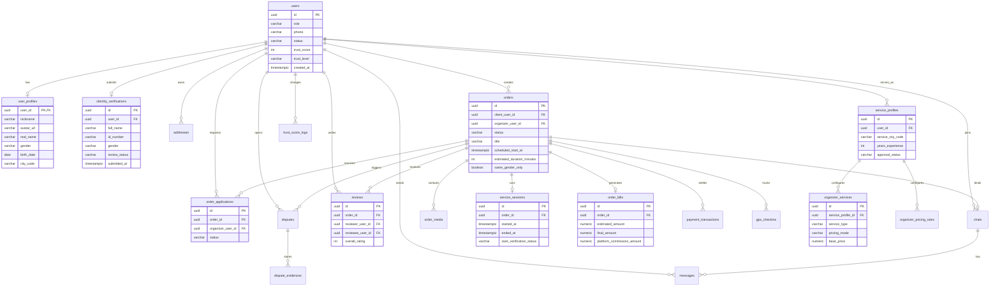

# 数据库 ER 图

```mermaid
erDiagram
    users ||--o| user_profiles : has
    users ||--o| identity_verifications : submits
    users ||--o{ addresses : owns
    users ||--o{ orders : creates
    users ||--o{ order_applications : requests
    users ||--o{ service_profiles : serves_as
    users ||--o{ chats : joins
    users ||--o{ messages : sends
    users ||--o{ reviews : writes
    users ||--o{ disputes : opens
    users ||--o{ trust_score_logs : changes

    orders ||--o{ order_media : contains
    orders ||--o{ order_applications : receives
    orders ||--o| service_sessions : runs
    orders ||--o| order_bills : generates
    orders ||--o{ reviews : receives
    orders ||--o{ disputes : triggers
    orders ||--o| chats : binds
    orders ||--o{ payment_transactions : settles
    orders ||--o{ gps_checkins : tracks

    service_profiles ||--o{ organizer_services : configures
    service_profiles ||--o{ organizer_pricing_rules : configures

    chats ||--o{ messages : has
    disputes ||--o{ dispute_evidences : stores

    users {
      uuid id PK
      varchar role
      varchar phone
      varchar status
      int trust_score
      varchar trust_level
      timestamptz created_at
    }

    user_profiles {
      uuid user_id PK,FK
      varchar nickname
      varchar avatar_url
      varchar real_name
      varchar gender
      date birth_date
      varchar city_code
    }

    identity_verifications {
      uuid id PK
      uuid user_id FK
      varchar full_name
      varchar id_number
      varchar gender
      varchar review_status
      timestamptz submitted_at
    }

    service_profiles {
      uuid id PK
      uuid user_id FK
      varchar service_city_code
      int years_experience
      varchar approval_status
    }

    organizer_services {
      uuid id PK
      uuid service_profile_id FK
      varchar service_type
      varchar pricing_mode
      numeric base_price
    }

    orders {
      uuid id PK
      uuid client_user_id FK
      uuid organizer_user_id FK
      varchar status
      varchar title
      timestamptz scheduled_start_at
      int estimated_duration_minutes
      boolean same_gender_only
    }

    order_applications {
      uuid id PK
      uuid order_id FK
      uuid organizer_user_id FK
      varchar status
    }

    service_sessions {
      uuid id PK
      uuid order_id FK
      timestamptz started_at
      timestamptz ended_at
      varchar start_verification_status
    }

    order_bills {
      uuid id PK
      uuid order_id FK
      numeric estimated_amount
      numeric final_amount
      numeric platform_commission_amount
    }

    reviews {
      uuid id PK
      uuid order_id FK
      uuid reviewer_user_id FK
      uuid reviewee_user_id FK
      int overall_rating
    }
```
